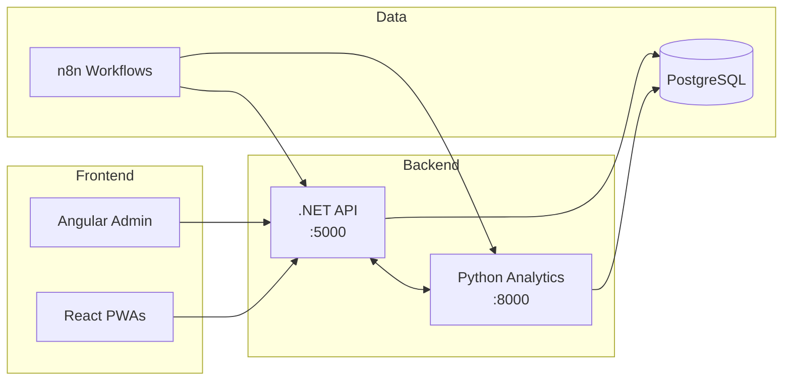
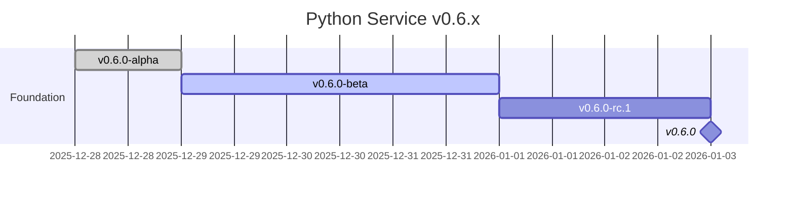
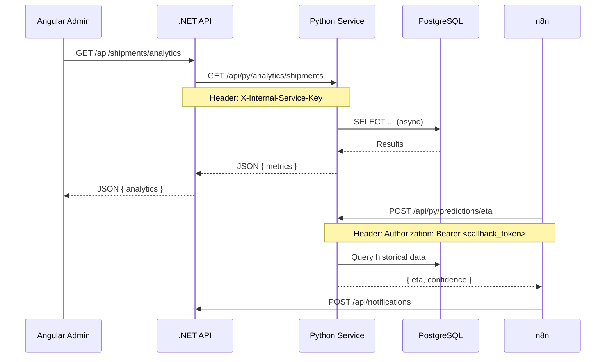

# Python Analytics Service - Documentación Técnica

**Version:** 0.6.0-alpha  
**Bounded Context:** Analytics & Predictions  
**Puerto:** 8000  
**Container:** parhelion-python

---

## 1. Visión General

El Python Analytics Service es un microservicio dedicado al **análisis avanzado de datos logísticos** y **predicciones basadas en ML**. Complementa el API .NET principal con capacidades especializadas de procesamiento de datos.



---

## 2. Los 10 Objetivos del Python Service

| #   | Objetivo                                                          | Versión     | Prioridad |
| --- | ----------------------------------------------------------------- | ----------- | --------- |
| 1   | **Health Monitoring** - Endpoints de estado y conectividad        | v0.6.0 ✅   | P0        |
| 2   | **Database Integration** - Conexión async a PostgreSQL compartido | v0.6.0 ✅   | P0        |
| 3   | **Service Auth** - Autenticación inter-servicios con .NET         | v0.6.0-beta | P0        |
| 4   | **Shipment Analytics** - Métricas históricas de envíos            | v0.7.x      | P1        |
| 5   | **Fleet Analytics** - KPIs de utilización de flota                | v0.7.x      | P1        |
| 6   | **ETA Prediction** - ML para estimación de tiempos                | v0.8.x      | P2        |
| 7   | **Anomaly Detection** - Alertas de retrasos potenciales           | v0.8.x      | P2        |
| 8   | **Excel Reports** - Generación dinámica con pandas                | v0.9.x      | P2        |
| 9   | **Dashboard Data** - Endpoints para KPIs en tiempo real           | v0.9.x      | P1        |
| 10  | **n8n Integration** - Callbacks y eventos bidireccionales         | v0.9.x      | P1        |

---

## 3. Estructura Actual (v0.6.0-alpha)

```
service-python/
├── pyproject.toml              # Configuración del proyecto
├── requirements.txt            # Dependencias para Docker
├── Dockerfile                  # Multi-stage build
├── README.md                   # Documentación del servicio
├── .env.example                # Template de variables
│
├── src/parhelion_py/
│   ├── __init__.py             # Package metadata
│   ├── main.py                 # FastAPI entry point
│   │
│   ├── domain/                 # 🔷 DOMAIN LAYER
│   │   ├── entities/           # (vacío - v0.7.x)
│   │   ├── value_objects/      # (vacío - v0.7.x)
│   │   ├── exceptions/         # (vacío - v0.7.x)
│   │   └── interfaces/         # (vacío - v0.7.x)
│   │
│   ├── application/            # 🔶 APPLICATION LAYER
│   │   ├── dtos/               # (vacío - v0.7.x)
│   │   ├── services/           # (vacío - v0.7.x)
│   │   └── interfaces/         # (vacío - v0.7.x)
│   │
│   ├── infrastructure/         # 🔵 INFRASTRUCTURE LAYER
│   │   ├── config/
│   │   │   └── settings.py     # ✅ Pydantic Settings
│   │   ├── database/
│   │   │   └── connection.py   # ✅ SQLAlchemy async
│   │   └── external/           # (vacío - v0.6.0-beta)
│   │
│   └── api/                    # 🟢 API LAYER
│       ├── routers/
│       │   └── health.py       # ✅ /health, /health/db, /health/ready
│       └── middleware/         # (vacío - v0.6.0-beta)
│
└── tests/
    ├── conftest.py             # ✅ pytest fixtures
    └── unit/
        └── test_health.py      # ✅ 4 tests pasando
```

### Componentes Implementados (v0.6.0-alpha)

| Componente    | Archivo                                 | Estado |
| ------------- | --------------------------------------- | ------ |
| FastAPI App   | `main.py`                               | ✅     |
| Settings      | `infrastructure/config/settings.py`     | ✅     |
| DB Connection | `infrastructure/database/connection.py` | ✅     |
| Health Router | `api/routers/health.py`                 | ✅     |
| Unit Tests    | `tests/unit/test_health.py`             | ✅ 4/4 |

---

## 4. Estructura Planeada (v0.7.x - v0.9.x)

```
service-python/src/parhelion_py/
│
├── domain/
│   ├── entities/
│   │   ├── base.py                 # BaseEntity, TenantEntity
│   │   ├── analytics_session.py    # AnalyticsSession
│   │   └── prediction_result.py    # PredictionResult
│   ├── value_objects/
│   │   ├── date_range.py           # DateRange VO
│   │   └── metrics.py              # ShipmentMetrics, FleetMetrics
│   ├── exceptions/
│   │   └── analytics_errors.py     # AnalyticsNotFoundError, etc.
│   └── interfaces/
│       └── repositories.py         # IAnalyticsRepository (Port)
│
├── application/
│   ├── dtos/
│   │   ├── requests.py             # AnalyticsRequest, PredictionRequest
│   │   └── responses.py            # AnalyticsResponse, ETAPrediction
│   ├── services/
│   │   ├── analytics_service.py    # ShipmentAnalytics, FleetAnalytics
│   │   ├── prediction_service.py   # ETAPredictionService
│   │   └── report_service.py       # ExcelReportService
│   └── interfaces/
│       └── external_services.py    # IParhelionApiClient
│
├── infrastructure/
│   ├── database/
│   │   ├── connection.py           # (existente)
│   │   ├── models.py               # SQLAlchemy models
│   │   └── repositories.py         # AnalyticsRepository (Adapter)
│   └── external/
│       └── parhelion_client.py     # Anti-Corruption Layer
│
└── api/
    ├── routers/
    │   ├── health.py               # (existente)
    │   ├── analytics.py            # /api/py/analytics/*
    │   ├── predictions.py          # /api/py/predictions/*
    │   └── reports.py              # /api/py/reports/*
    ├── middleware/
    │   ├── auth.py                 # ServiceApiKey validation
    │   └── tenant.py               # Multi-tenant context
    └── dependencies.py             # FastAPI Depends()
```

---

## 5. Roadmap de Desarrollo

### v0.6.x - Foundation (EN PROGRESO)



| Release          | Nombre      | Entregables                                 |
| ---------------- | ----------- | ------------------------------------------- |
| **v0.6.0-alpha** | Foundation  | ✅ Estructura, health, DB connection, tests |
| v0.6.0-beta      | Integration | Auth middleware, ParhelionApiClient (ACL)   |
| v0.6.0-rc.1      | Validation  | E2E tests, logging estructurado             |
| **v0.6.0**       | Release     | GitHub Actions, docs actualizadas           |

---

### v0.7.x - Analytics Core

| Release | Feature                 | Endpoints                               |
| ------- | ----------------------- | --------------------------------------- |
| v0.7.0  | Shipment Analytics Base | `GET /api/py/analytics/shipments`       |
| v0.7.1  | Fleet Analytics Base    | `GET /api/py/analytics/fleet`           |
| v0.7.2  | Filtros Avanzados       | Query params: date, status, driver      |
| v0.7.3  | Aggregations            | Métricas por período, tenant            |
| v0.7.4  | Caching                 | Redis/in-memory para queries frecuentes |

---

### v0.8.x - Machine Learning

| Release | Feature             | Modelo                   |
| ------- | ------------------- | ------------------------ |
| v0.8.0  | ETA Prediction Base | Regresión lineal         |
| v0.8.1  | Feature Engineering | Historial de checkpoints |
| v0.8.2  | Model Improvement   | Gradient Boosting        |
| v0.8.3  | Anomaly Detection   | Isolation Forest         |
| v0.8.4  | Confidence Scoring  | Intervalos de predicción |

---

### v0.9.x - Reports & Dashboard

| Release | Feature             | Output                   |
| ------- | ------------------- | ------------------------ |
| v0.9.0  | Excel Base          | pandas + openpyxl        |
| v0.9.1  | Report Templates    | Diario, Semanal, Mensual |
| v0.9.2  | Dashboard Endpoints | KPIs en JSON             |
| v0.9.3  | Real-time Metrics   | WebSocket support        |
| v0.9.4  | n8n Callbacks       | Event-driven analytics   |

---

## 6. Diagrama de Capas (Clean Architecture)

```
┌─────────────────────────────────────────────────────────────┐
│                        API LAYER                             │
│  ┌─────────────┐  ┌─────────────┐  ┌─────────────┐          │
│  │   Health    │  │  Analytics  │  │ Predictions │          │
│  │   Router    │  │   Router    │  │   Router    │          │
│  └──────┬──────┘  └──────┬──────┘  └──────┬──────┘          │
│         │                │                │                  │
│  ┌──────┴────────────────┴────────────────┴──────┐          │
│  │              Middleware (Auth, Tenant)         │          │
│  └────────────────────────┬──────────────────────┘          │
├───────────────────────────┼─────────────────────────────────┤
│                           ▼                                  │
│                  APPLICATION LAYER                           │
│  ┌─────────────┐  ┌─────────────┐  ┌─────────────┐          │
│  │  Analytics  │  │ Prediction  │  │   Report    │          │
│  │   Service   │  │   Service   │  │   Service   │          │
│  └──────┬──────┘  └──────┬──────┘  └──────┬──────┘          │
│         │                │                │                  │
│  ┌──────┴────────────────┴────────────────┴──────┐          │
│  │                    DTOs                        │          │
│  └────────────────────────┬──────────────────────┘          │
├───────────────────────────┼─────────────────────────────────┤
│                           ▼                                  │
│                    DOMAIN LAYER                              │
│  ┌─────────────┐  ┌─────────────┐  ┌─────────────┐          │
│  │  Entities   │  │    Value    │  │ Interfaces  │          │
│  │             │  │   Objects   │  │   (Ports)   │          │
│  └─────────────┘  └─────────────┘  └──────┬──────┘          │
├───────────────────────────────────────────┼─────────────────┤
│                                           ▼                  │
│                 INFRASTRUCTURE LAYER                         │
│  ┌─────────────┐  ┌─────────────┐  ┌─────────────┐          │
│  │  Database   │  │  External   │  │   Config    │          │
│  │ (Adapters)  │  │  Clients    │  │  (Settings) │          │
│  └──────┬──────┘  └──────┬──────┘  └─────────────┘          │
│         │                │                                   │
│         ▼                ▼                                   │
│  ┌─────────────┐  ┌─────────────┐                           │
│  │ PostgreSQL  │  │  .NET API   │                           │
│  └─────────────┘  └─────────────┘                           │
└─────────────────────────────────────────────────────────────┘
```

---

## 7. Tecnologías y Dependencias

| Categoría       | Tecnología              | Versión     |
| --------------- | ----------------------- | ----------- |
| **Runtime**     | Python                  | 3.12+       |
| **Framework**   | FastAPI                 | 0.115+      |
| **ASGI Server** | Uvicorn + Gunicorn      | 0.32+ / 23+ |
| **ORM**         | SQLAlchemy              | 2.0+        |
| **DB Driver**   | asyncpg                 | 0.30+       |
| **Validation**  | Pydantic                | 2.10+       |
| **HTTP Client** | httpx                   | 0.28+       |
| **Auth**        | python-jose             | 3.3+        |
| **Testing**     | pytest + pytest-asyncio | 8.3+        |
| **Linting**     | Ruff                    | 0.8+        |
| **Type Check**  | MyPy                    | 1.13+       |

### Dependencias Futuras (v0.8.x+)

| Categoría | Tecnología   | Uso                    |
| --------- | ------------ | ---------------------- |
| **ML**    | scikit-learn | Predicciones           |
| **Data**  | pandas       | DataFrames             |
| **Math**  | numpy        | Operaciones numéricas  |
| **Excel** | openpyxl     | Generación de reportes |

---

## 8. Endpoints Actuales y Planeados

### Implementados (v0.6.0-alpha)

```bash
GET  /health         # Estado del servicio
GET  /health/db      # Conectividad PostgreSQL
GET  /health/ready   # Readiness probe (K8s)
GET  /docs           # Swagger UI (dev only)
```

### Planeados (v0.7.x+)

```bash
# Analytics
GET  /api/py/analytics/shipments          # Métricas de envíos
GET  /api/py/analytics/fleet              # Métricas de flota
GET  /api/py/analytics/drivers/{id}       # Por chofer

# Predictions
POST /api/py/predictions/eta              # Predicción ETA
POST /api/py/predictions/anomalies        # Detección anomalías

# Reports
POST /api/py/reports/export               # Generar Excel
GET  /api/py/reports/{id}/download        # Descargar reporte

# Dashboard
GET  /api/py/dashboard/kpis               # KPIs principales
GET  /api/py/dashboard/realtime           # Métricas tiempo real
```

---

## 9. Variables de Entorno

| Variable               | Requerida | Default                     | Descripción                 |
| ---------------------- | --------- | --------------------------- | --------------------------- |
| `DATABASE_URL`         | ✅        | -                           | PostgreSQL async connection |
| `JWT_SECRET`           | ✅        | -                           | Secret para validar tokens  |
| `INTERNAL_SERVICE_KEY` | ✅        | -                           | Auth inter-servicios        |
| `PARHELION_API_URL`    | No        | `http://parhelion-api:5000` | URL del API .NET            |
| `ENVIRONMENT`          | No        | `development`               | dev/production/testing      |
| `LOG_LEVEL`            | No        | `info`                      | debug/info/warning/error    |
| `WORKERS`              | No        | `4`                         | Gunicorn workers            |

---

## 10. Comunicación Inter-Servicios



---

**Última actualización:** 2025-12-28  
**Próxima milestone:** v0.6.0-beta (Auth + ACL)
